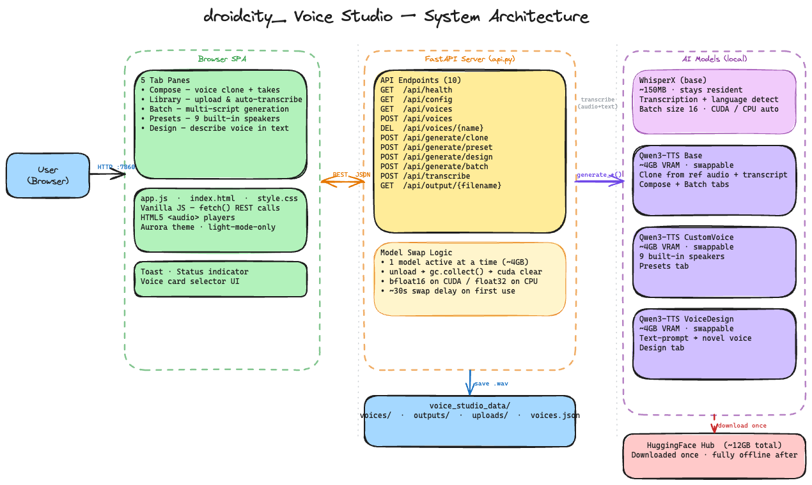

# droidcity_ Voice Studio

Local Qwen3-TTS voice cloning UI. FastAPI backend + pure HTML/CSS/JS frontend. AI-powered transcription with WhisperX.

## Architecture diagram


## Setup

```powershell
# Create & activate venv
python -m venv .venv
.\.venv\Scripts\activate

# Install PyTorch with CUDA (requires NVIDIA GPU)
pip install torch torchvision torchaudio --index-url https://download.pytorch.org/whl/cu124

# Install dependencies
pip install -r requirements.txt
```

## Run

```powershell
python api.py
```

Then open: **http://localhost:7860**

## File structure

```
voice_agent/
├── api.py                # FastAPI backend (all endpoints + model management)
├── requirements.txt      # Python dependencies
├── static/
│   ├── index.html        # SPA with 5 tab panes
│   ├── style.css         # Aurora aesthetic, light-mode-only
│   └── app.js            # Frontend logic, API client, voice cards
├── voice_studio_data/    # Auto-created on first run
│   ├── voices/           # Saved reference audio files
│   ├── outputs/          # Generated TTS clips
│   ├── uploads/          # Temp files for transcription
│   └── voices.json       # Voice library index
└── Readme.md
```

## Tabs

| Tab | What it does | Model used |
|-----|-------------|------------|
| **Compose** | Clone a saved voice — pick voice card, type script, generate multiple takes | Base |
| **Library** | Upload reference audio → auto-transcribed by WhisperX → review → save | — |
| **Batch** | Generate multiple clips from a list of scripts using a saved voice | Base |
| **Presets** | Use built-in speakers (Vivian, Ryan, Aiden, etc.) with optional instruction | CustomVoice |
| **Design** | Describe a voice in natural language → model creates it from scratch | VoiceDesign |

## API endpoints

| Method | Path | Description |
|--------|------|-------------|
| GET | `/api/config` | Languages, preset speakers list |
| GET | `/api/voices` | List saved voices |
| POST | `/api/voices` | Save new voice (audio + transcript) |
| DELETE | `/api/voices/{name}` | Delete a voice |
| POST | `/api/generate/clone` | Generate cloned speech |
| POST | `/api/generate/preset` | Generate with preset speaker |
| POST | `/api/generate/design` | Generate with voice design |
| POST | `/api/generate/batch` | Batch generate multiple scripts |
| POST | `/api/transcribe` | Transcribe audio via WhisperX |
| GET | `/api/output/{filename}` | Download generated audio |

## VRAM management

Three Qwen3-TTS model variants (~4GB each). Only one is loaded into VRAM at a time. Switching between tabs that use different models triggers automatic unload → garbage collect → load cycle (~30s on first swap). WhisperX runs separately and stays resident once loaded.

## Storage

- Models download to `~/.cache/huggingface/hub/` on first use (~4GB per model, 12GB total)
- WhisperX base model is ~150MB

## Notes

- **Desktop only** — requires ≥1280px browser width
- **Light mode locked** — ignores system dark mode preference
- **GPU recommended** — falls back to CPU (float32) if no CUDA, but generation is much slower
- Outputs saved to `voice_studio_data/outputs/` and downloadable via UI

## Voice cloning tips

- 30–60 sec reference audio, quiet room, natural prosody
- Varied energy (questions, statements, exclamations) works best
- Accurate transcript is critical — WhisperX auto-transcribes on upload, review before saving